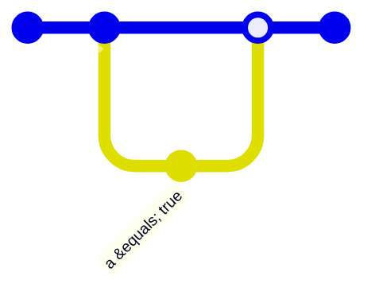
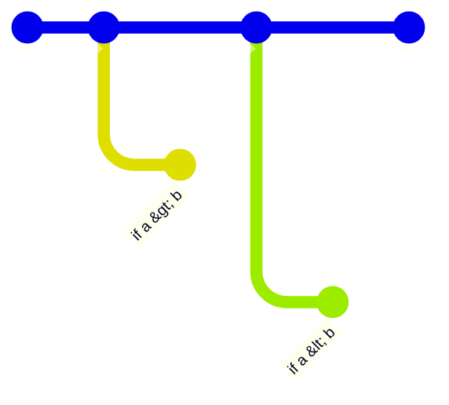
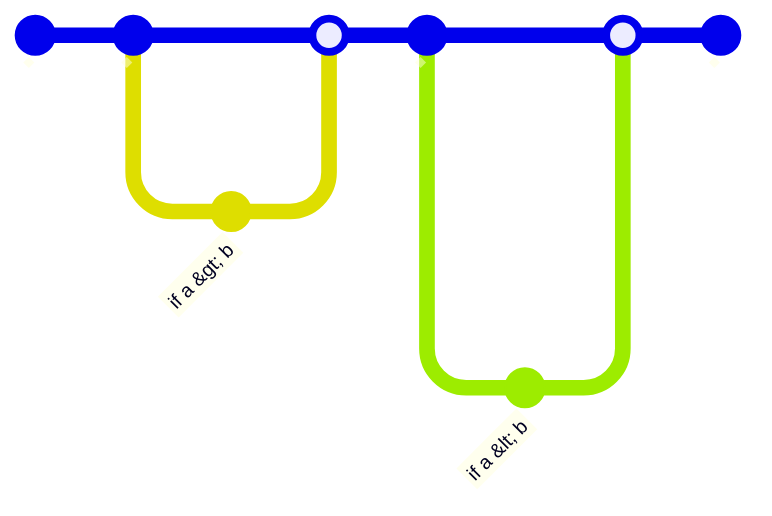
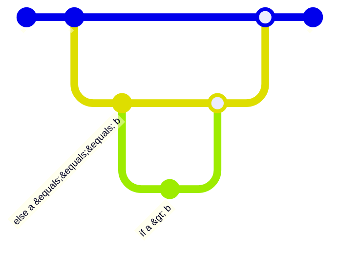

# test-coverage-calculation

**This is purely theoretical speculations about how code coverage may be calculated.**

It's all started with this code:

```js
export function comp(a, b) {
  if (a > b) return 1;
  if (a < b) return -1;
  return 0;
}
```

[Most of code coverage tools would say this code has 4 branches](https://github.com/stereobooster/vitest-coverage-v8). Which seemed strange to me. So I wondered why...

## Comparison of branch coverage

|               | `@vitest/coverage-istanbul` | `vitest-monocart-coverage` | `@vitest/coverage-v8` | what I expect |
| ------------- | --------------------------- | -------------------------- | --------------------- | ------------- |
| example0.1.js | 0/0                         | 0/0                        | 1/1                   | 1/1           |
| example0.2.js | 2/2                         | 2/2                        | 2/2                   | 2/2           |
| example1.1.js | 4/4                         | 4/4                        | 4/4                   | 3/3           |
| example1.2.js | 4/4                         | 4/4                        | **3/3**               | 4/4           |
| example1.3.js | 4/4                         | 4/4                        | **3/3**               | 4/4           |
| example1.4.js | 6/6                         | 6/6                        | **4/4**               | 6/6           |
| example1.5.js | 4/4                         | 4/4                        | **5/5**               | 3/3           |
| example2.1.js | 4/4                         | 4/4                        | 4/4                   | 3/3           |
| example3.1.js | 2/2                         | 2/2                        | 2/2                   | 2/2 or 1/1    |
| example3.2.js | 2/2                         | 2/2                        | 2/2                   | 2/2 or 1/1    |
| example3.3.js | 2/2                         | 2/2                        | **3/3**               | 2/2 or 1/1    |
| example3.4.js | 4/4                         | 4/4                        | **3/3**               | 2/2 or 4/4    |
| example4.1.js | 2/2                         | 2/2                        | **3/3**               | 2/2           |
| example4.2.js | **1/1**                     | **1/1**                    | 2/2                   | 2/2           |
| example4.3.js | 2/2                         | 2/2                        | 2/2                   | 2/2           |
| example4.4.js | 3/3                         | **2/3**                    | 3/3                   | 3/3           |
| example5.1.js | 0/0                         | 0/0                        | 2/2                   | 2/2           |
| example6.1.js | 0/0                         | 0/0                        | 2/2                   | 2/2 or 1/1    |
| example6.2.js | 0/0                         | 0/0                        | 2/2                   | 2/2           |
| example7.1.js | 0/0                         | 0/0                        | 2/2                   | 2/2           |
| example8.1.js | 0/0                         | 0/0                        | **1/2**               | 1/3           |

**Note**: if you have 100% coverage you probably don't care if it is 3/3 or 5/5. This would make a difference it you have less than 100%, than number can be skewed.

## Example 1

1 branch (or no branching):

```js
console.log(1);
```

2 branches:

```js
console.log(1);

if (a) {
  console.log(2);
}
```



**Important** even so for `a = true` it would visit all lines of code, we as well need to execute code with `a = false` to claim that all cases have been covered.

And this is basically explains why it counts 4 branches here:

```js
export function comp(a, b) {
  if (a > b) return 1;
  if (a < b) return -1;
  return 0;
}
```

|     | `a > b` | `a < b` |
| --- | ------- | ------- |
| 1   | true    | true    |
| 2   | true    | false   |
| 3   | false   | true    |
| 4   | false   | false   |

**But** there is no difference between cases 1 and 2. If the first condition is true we will never reach code in the second condition, because of early return.



On the other hand, code like this:

```js
export function comp(a, b) {
  let result = 0;
  if (a > b) result = 1;
  if (a < b) result = -1;
  return result;
}
```

Indeed has 4 branches:



### Branches != paths

In example above we have 4 branches and coincidentally 4 paths. All branches can be reached, but not all paths, because there are no such values that `a > b` and `a < b`.

Let's take a different example:

```js
export function experiment(a, b) {
  let result = 0;
  if (a) result += 1;
  if (b) result += 2;
  return result;
}
```

All branches can be covered with two tests:

```js
expect(experiment(false, false)).toBe(0);
expect(experiment(true, true)).toBe(3);
```

But to cover all paths you need 2 more tests:

```js
expect(experiment(true, false)).toBe(1);
expect(experiment(false, true)).toBe(2);
```

One more example:

```js
export function experiment(a, b, c) {
  let result = 0;
  if (a) result += 1;
  if (b) result += 2;
  if (c) result += 4;
  return result;
}
```

It has 6 branches, but 8 paths.

### 100% branch or path coverage may be not enough

Let's take the same example, we started with:

```js
export function comp(a, b) {
  if (a > b) return 1;
  if (a < b) return -1;
  return 0;
}
```

And write 100% test coverage:

```js
expect(comp(1, 1)).toBe(0);
expect(comp(1, 0)).toBe(1);
expect(comp(0, 1)).toBe(-1);
```

We still miss edge cases for `NaN`:

```js
(comp(1, 1) === comp(1, NaN)) === comp(NaN, 1);
```

Which may be not a desired behaviour.

## Example 2

```js
export function comp(a, b) {
  let result;
  if (a === b) result = 0;
  else if (a > b) result = 1;
  else result = -1;
  return result;
}
```

This code has 3 branches:



Even so most coverage tools will report 4 branches.

## Example 3

So far we talked only about `if/else`. Let's talk about other "branching" constructs

```js
a && b();
// is the same as
if (a) b();

a || b();
// is the same as
if (!a) b();

a ? b() : c():
// is the same as
if (!a) b(); else c();
```

Which makes sense. But what about this example:

```js
if (a || b) {
  console.log(1);
}
```

Using logic above this code can be estimated to have 4 branches. But it seems more natural to count it as 2 branches (4 paths?). WDYT?

With exceptions if second operand (`b`) is a function call (`b()`) or property accessor (`b.something`), which may be [a getter](https://developer.mozilla.org/en-US/docs/Web/JavaScript/Reference/Functions/get).

Shall we count code like this:

```js
let x = a ? 1 : 2;
```

as 2 branches or as 1 branch (but 2 paths)?

## Example 4

This should count as 2 branches:

```js
switch (a) {
  case 1:
    //...
    break;
  default:
  //...
}
```

This is 2 branches as well:

```js
switch (a) {
  case 1:
    //...
    break;
}
```

This is 2 branches as well:

```js
switch (a) {
  case 1:
  //...
  default:
  //...
}
```

This is 3 branches:

```js
switch (a) {
  case 1:
  //...
  case 3:
  //...
  default:
  //...
}
```

Is this 2 or 3 branches:

```js
switch (a) {
  case 1:
  case 3:
  //...
  default:
  //...
}
```

## Example 5

This should count as 2 branches (?):

```js
try {
  a(x);
  b(y);
  //...
} catch (e) {
  //...
}
```

But what if each function (`a`, `b`) can throw an exception. Shall we count it as 3 (or 4) branches? On the other hand there is no way to know this from statical analysis unless we have type system with effects, like in [koka](https://koka-lang.github.io/koka/doc/book.html#why-effects).

## Example 6

This should count as 2 branches

```js
for (let i = 0; i < j; i++) {
  //
}
```

Because depending on the value of `j` we may or may not "get inside" `for` statement. On the other hand - this is 1 branch:

```js
for (let i = 0; i < 10; i++) {
  //
}
```

Same argument applies to `while`:

```js
while (j < 3) {
  //...
}
```

`do` always counts as 1 branch

```js
do {
  //...
} while (j < 3);
```

## Example 7

Do we count [optional chaining](https://developer.mozilla.org/en-US/docs/Web/JavaScript/Reference/Operators/Optional_chaining) as branching?

```js
let x = a?.something;
```

It should be counted the same way as:

```js
let x = a == null ? undefined : a.something;
```

Do we count whole chain as 2 branches or do we add branch for each link:

```js
let x = a?.something?.else;
```

Same goes to [nullish coalescing](https://developer.mozilla.org/en-US/docs/Web/JavaScript/Reference/Operators/Nullish_coalescing) and [nullish coalescing assignment](https://developer.mozilla.org/en-US/docs/Web/JavaScript/Reference/Operators/Nullish_coalescing_assignment)

## Example 8

Do we count each `yield` in [generator](https://developer.mozilla.org/en-US/docs/Web/JavaScript/Reference/Global_Objects/Generator) as branch?

```js
const x = function* () {
  yield "a";
  yield "b";
  yield "c";
};
```
